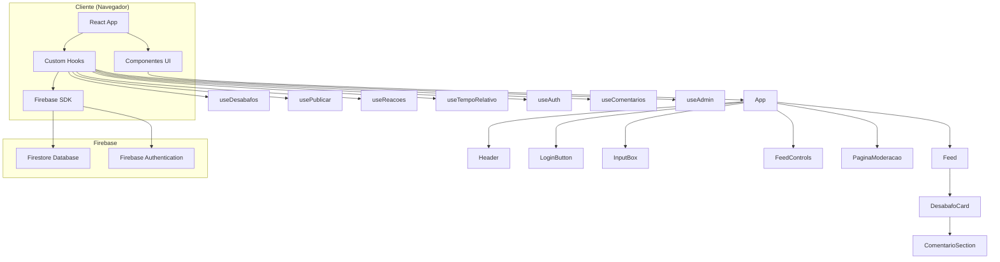
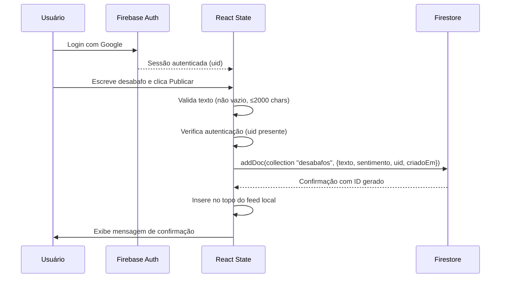
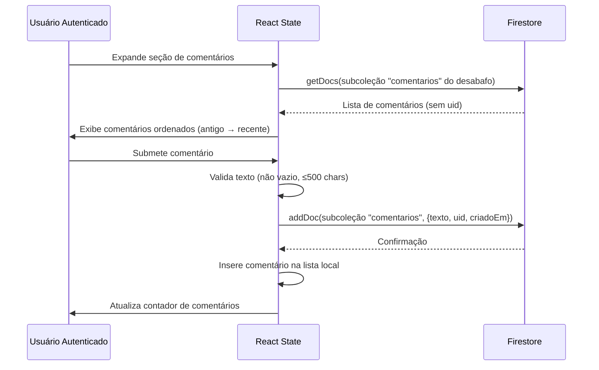
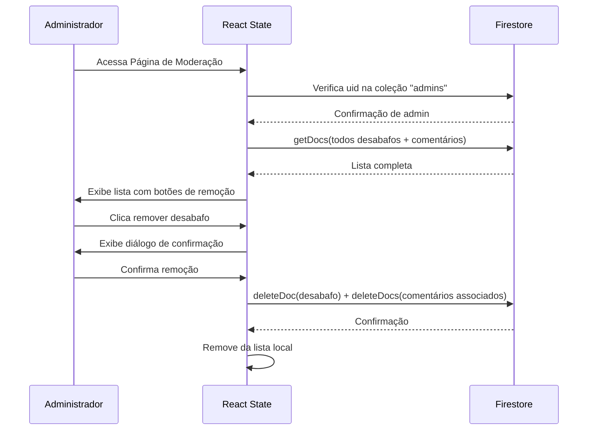

# Design Document

## Overview

O Desabafo Anônimo é uma aplicação web de desabafos anônimos construída com React e Firebase (Firestore + Authentication). A aplicação permite que usuários autenticados via Google publiquem textos expressando seus sentimentos de forma anônima para os leitores, visualizem um feed paginado de desabafos, filtrem por sentimento, reajam com empatia, e comentem nos desabafos de outros. Visitantes não autenticados podem visualizar o feed e reagir, mas não podem publicar ou comentar.

A arquitetura segue o padrão de Single Page Application (SPA) com React gerenciando o estado da UI, Firebase Authentication para controle de acesso, e Firestore como backend serverless para persistência. Administradores cadastrados em uma coleção dedicada possuem acesso a uma página de moderação para remoção de conteúdo inadequado.

### Decisões de Design Principais

1. **React sem framework adicional**: Utilizar Vite como bundler, sem Next.js ou similar, pois a aplicação é puramente client-side sem necessidade de SSR.
2. **Firestore como única fonte de verdade**: Todos os desabafos e comentários são persistidos e lidos diretamente do Firestore.
3. **Firebase Authentication com Google**: Autenticação obrigatória para publicar desabafos e comentários. O uid é armazenado internamente mas nunca exposto no feed.
4. **Anonimato na visualização**: As regras de segurança do Firestore garantem que o campo `uid` só é legível por administradores. Consultas do cliente para o feed não retornam dados identificáveis.
5. **Paginação com cursor**: Utilizar `startAfter` do Firestore para paginação eficiente baseada em cursor.
6. **Optimistic UI para reações**: Incrementar o contador localmente antes da confirmação do Firestore, revertendo em caso de erro.
7. **Coleção de admins no Firestore**: Controle de acesso à moderação via coleção `admins` no Firestore.
8. **Comentários como subcoleção**: Comentários armazenados como subcoleção de cada desabafo para facilitar queries e remoção em cascata.

## Architecture



### Fluxo de Dados - Publicação



### Fluxo de Dados - Comentários



### Fluxo de Dados - Moderação



### Camadas da Aplicação

| Camada | Responsabilidade | Tecnologia |
|--------|-----------------|------------|
| Apresentação | Renderização de componentes, estilos | React, CSS |
| Lógica de Estado | Gerenciamento de estado local e efeitos | React Hooks (useState, useEffect) |
| Autenticação | Login/logout, estado de sessão | Firebase Authentication (Google Provider) |
| Serviço de Dados | Comunicação com Firestore | Firebase SDK v9+ (modular) |
| Persistência | Armazenamento de desabafos, comentários e admins | Cloud Firestore |
| Segurança | Controle de acesso a dados | Firestore Security Rules |

## Components and Interfaces

### Identidade Visual

A identidade visual do Desabafo Anônimo transmite anonimato, introspecção e acolhimento através de uma paleta escura com acentos sutis. O tema escuro reforça a sensação de privacidade e segurança — como um espaço protegido onde o usuário pode se expressar sem ser visto.

#### Paleta de Cores

| Token | Cor | Hex | Uso |
|-------|-----|-----|-----|
| `--cor-fundo` | Cinza muito escuro | `#1a1a2e` | Fundo principal da aplicação |
| `--cor-superficie` | Azul escuro profundo | `#16213e` | Cards, containers, áreas elevadas |
| `--cor-superficie-alt` | Azul noturno | `#0f3460` | Inputs, selects, áreas interativas |
| `--cor-texto` | Cinza claro | `#e0e0e0` | Texto principal |
| `--cor-texto-secundario` | Cinza médio | `#a0a0a0` | Texto secundário, timestamps, placeholders |
| `--cor-borda` | Cinza escuro | `#2a2a4a` | Bordas sutis entre elementos |
| `--cor-acento` | Roxo suave | `#7b68ee` | Botões primários, links, destaques |
| `--cor-acento-hover` | Roxo claro | `#9b8afb` | Estado hover de botões |
| `--cor-sucesso` | Verde escuro | `#2d6a4f` | Mensagens de sucesso/acolhimento |
| `--cor-erro` | Vermelho escuro | `#9b2335` | Mensagens de erro |

#### Cores por Sentimento (Borda lateral dos cards)

| Sentimento | Cor | Hex | Significado |
|------------|-----|-----|-------------|
| Tristeza | Azul melancólico | `#4a90d9` | Introspecção, melancolia |
| Raiva | Vermelho contido | `#d94a4a` | Intensidade, frustração |
| Alívio | Verde sereno | `#4ad9a0` | Calma, liberação |

#### Tipografia

| Elemento | Fonte | Tamanho | Peso |
|----------|-------|---------|------|
| Título principal | Inter | 1.75rem | 700 |
| Subtítulos | Inter | 1.25rem | 600 |
| Texto do desabafo | Inter | 1rem | 400 |
| Texto secundário | Inter | 0.875rem | 400 |
| Botões | Inter | 0.875rem | 500 |

#### Espaçamento e Bordas

- **Border-radius dos cards**: 12px
- **Borda lateral do sentimento**: 4px sólida
- **Espaçamento interno dos cards**: 1.25rem
- **Gap entre cards no feed**: 1rem
- **Container máximo**: 640px centralizado
- **Sombra dos cards**: `0 2px 8px rgba(0, 0, 0, 0.3)`

#### Efeitos e Transições

- Transição suave em hover dos botões: `transition: all 0.2s ease`
- Botões de reação com leve escala no hover: `transform: scale(1.05)`
- Mensagem de feedback com fade-in/fade-out de 300ms
- Loading indicator com animação de pulso

### Árvore de Componentes

```
App
├── Header
│   ├── Título + Aviso
│   ├── LoginButton (Entrar com Google / Sair)
│   └── Link Moderação (visível apenas para admins)
├── InputBox (visível apenas para autenticados)
│   ├── textarea (texto do desabafo)
│   ├── select (sentimento)
│   ├── button (Publicar)
│   └── Feedback (mensagem de confirmação/erro)
├── MensagemLogin (visível apenas para visitantes)
├── FeedControls
│   ├── select (filtro por sentimento)
│   └── span (contador)
├── Feed
│   ├── LoadingIndicator
│   ├── EmptyState
│   ├── DesabafoCard[]
│   │   ├── texto
│   │   ├── TempoRelativo
│   │   ├── Reacoes (3 botões com contadores)
│   │   └── ComentarioSection
│   │       ├── BotaoExpandir (com contador de comentários)
│   │       ├── ListaComentarios[]
│   │       │   ├── texto
│   │       │   └── TempoRelativo
│   │       ├── CampoComentario (visível apenas para autenticados)
│   │       └── MensagemLoginComentario (visível para visitantes)
│   └── button (Carregar mais)
├── PaginaModeracao (rota protegida para admins)
│   ├── ListaDesabafos (com botão remover individual)
│   ├── ListaComentarios (com botão remover individual)
│   ├── BotaoApagarTudo + ConfirmDialog
│   └── ConfirmDialog (remoção individual)
```

### Interfaces dos Componentes

```typescript
// Props do LoginButton
interface LoginButtonProps {
  usuario: UsuarioAuth | null;
  onLogin: () => Promise<void>;
  onLogout: () => Promise<void>;
  isLoading: boolean;
}

// Props do InputBox
interface InputBoxProps {
  onPublicar: (texto: string, sentimento: Sentimento) => Promise<void>;
  isPublicando: boolean;
}

// Props do Feed
interface FeedProps {
  desabafos: Desabafo[];
  isLoading: boolean;
  hasMore: boolean;
  onLoadMore: () => void;
  onReagir: (id: string, tipo: TipoReacao) => void;
  usuarioAutenticado: boolean;
}

// Props do DesabafoCard
interface DesabafoCardProps {
  desabafo: Desabafo;
  onReagir: (tipo: TipoReacao) => void;
  usuarioAutenticado: boolean;
}

// Props do ComentarioSection
interface ComentarioSectionProps {
  desabafoId: string;
  usuarioAutenticado: boolean;
}

// Props do FeedControls
interface FeedControlsProps {
  filtroAtivo: Sentimento | 'todos';
  onFiltroChange: (filtro: Sentimento | 'todos') => void;
  totalDesabafos: number;
}

// Props do ConfirmDialog
interface ConfirmDialogProps {
  isOpen: boolean;
  mensagem: string;
  onConfirmar: () => void;
  onCancelar: () => void;
}

// Props da PaginaModeracao
interface PaginaModeracaoProps {
  isAdmin: boolean;
}
```

### Custom Hooks

```typescript
// Hook de autenticação com Firebase Auth
function useAuth() {
  // Retorna: { usuario, isLoading, login, logout, isAutenticado }
  // usuario: { uid: string } | null (sem expor nome/email para componentes do feed)
  // login: inicia fluxo Google popup
  // logout: encerra sessão
}

// Hook para verificar se o usuário é administrador
function useAdmin(uid: string | null) {
  // Retorna: { isAdmin, isLoading }
  // Consulta a coleção "admins" no Firestore
}

// Hook principal para gerenciar o feed de desabafos
function useDesabafos(filtro: Sentimento | 'todos') {
  // Retorna: { desabafos, isLoading, error, hasMore, loadMore, refresh, total }
}

// Hook para publicar desabafos (requer uid)
function usePublicar(uid: string) {
  // Retorna: { publicar, isPublicando, error }
}

// Hook para reações (não requer autenticação)
function useReacoes() {
  // Retorna: { reagir, isReagindo }
}

// Hook para comentários de um desabafo específico
function useComentarios(desabafoId: string) {
  // Retorna: { comentarios, isLoading, publicarComentario, totalComentarios }
}

// Hook para tempo relativo com auto-refresh
function useTempoRelativo(data: Date): string {
  // Retorna string formatada, atualiza a cada 60s
}
```

### Serviço Firebase

```typescript
// firebase/config.ts - Configuração do Firebase
const firebaseConfig = { /* credenciais do projeto */ };
const app = initializeApp(firebaseConfig);
const db = getFirestore(app);
const auth = getAuth(app);

// firebase/auth.ts - Operações de autenticação
async function loginComGoogle(): Promise<UserCredential>;
async function logout(): Promise<void>;
function onAuthChange(callback: (user: User | null) => void): Unsubscribe;

// firebase/desabafos.ts - Operações no Firestore
async function criarDesabafo(texto: string, sentimento: Sentimento, uid: string): Promise<string>;
async function buscarDesabafos(filtro: Sentimento | 'todos', limite: number, cursor?: DocumentSnapshot): Promise<QueryResult>;
async function incrementarReacao(desabafoId: string, tipo: TipoReacao): Promise<void>;
async function removerDesabafo(desabafoId: string): Promise<void>;
async function apagarTodosDesabafos(): Promise<void>;

// firebase/comentarios.ts - Operações de comentários
async function criarComentario(desabafoId: string, texto: string, uid: string): Promise<string>;
async function buscarComentarios(desabafoId: string, limite: number): Promise<Comentario[]>;
async function removerComentario(desabafoId: string, comentarioId: string): Promise<void>;
async function removerComentariosDoDesabafo(desabafoId: string): Promise<void>;

// firebase/admin.ts - Operações de administração
async function verificarAdmin(uid: string): Promise<boolean>;
async function buscarTodosDesabafosAdmin(): Promise<DesabafoAdmin[]>;
async function buscarTodosComentariosAdmin(): Promise<ComentarioAdmin[]>;
```

## Data Models

### Modelo do Desabafo (Documento Firestore)

```typescript
// Tipos base
type Sentimento = 'triste' | 'raiva' | 'alivio';
type TipoReacao = 'apoio' | 'forca' | 'pouco';

// Documento no Firestore (coleção: "desabafos")
interface DesabafoDoc {
  texto: string;              // Texto do desabafo (1-2000 caracteres)
  sentimento: Sentimento;     // Categoria emocional
  criadoEm: Timestamp;       // Timestamp do Firestore (serverTimestamp)
  uid: string;                // Identificador do autor (Firebase Auth uid) - NÃO exposto no feed
  reacoes: {
    apoio: number;            // Contador "Eu me identifiquei"
    forca: number;            // Contador "Força"
    pouco: number;            // Contador "Eu acho é pouco"
  };
  totalComentarios: number;   // Contador de comentários (desnormalizado para performance)
}

// Modelo no React para exibição no feed (SEM uid)
interface Desabafo {
  id: string;                 // ID do documento Firestore
  texto: string;
  sentimento: Sentimento;
  criadoEm: Date;            // Convertido de Timestamp para Date
  reacoes: {
    apoio: number;
    forca: number;
    pouco: number;
  };
  totalComentarios: number;
}

// Modelo para administradores (COM uid para moderação)
interface DesabafoAdmin extends Desabafo {
  uid: string;
}
```

### Modelo do Comentário (Subcoleção Firestore)

```typescript
// Documento no Firestore (subcoleção: "desabafos/{desabafoId}/comentarios")
interface ComentarioDoc {
  texto: string;              // Texto do comentário (1-500 caracteres)
  criadoEm: Timestamp;       // Timestamp do Firestore (serverTimestamp)
  uid: string;                // Identificador do autor - NÃO exposto no feed
}

// Modelo no React para exibição (SEM uid)
interface Comentario {
  id: string;                 // ID do documento Firestore
  texto: string;
  criadoEm: Date;
  desabafoId: string;         // Referência ao desabafo pai
}

// Modelo para administradores (COM uid)
interface ComentarioAdmin extends Comentario {
  uid: string;
}
```

### Modelo do Administrador

```typescript
// Documento no Firestore (coleção: "admins")
// O ID do documento é o uid do Firebase Auth
interface AdminDoc {
  criadoEm: Timestamp;       // Data de adição como admin
}
```

### Modelo de Autenticação (Estado React)

```typescript
// Estado do usuário autenticado no React
interface UsuarioAuth {
  uid: string;                // Único dado necessário para operações
}
```

### Estrutura do Firestore

```
firestore/
├── desabafos/                    (coleção)
│   ├── {auto-id-1}/             (documento)
│   │   ├── texto: "..."
│   │   ├── sentimento: "triste"
│   │   ├── criadoEm: Timestamp
│   │   ├── uid: "firebase-auth-uid"    ← restrito a admins via rules
│   │   ├── reacoes: { apoio: 0, forca: 0, pouco: 0 }
│   │   ├── totalComentarios: 0
│   │   └── comentarios/         (subcoleção)
│   │       ├── {auto-id-a}/
│   │       │   ├── texto: "..."
│   │       │   ├── criadoEm: Timestamp
│   │       │   └── uid: "firebase-auth-uid"  ← restrito a admins via rules
│   │       └── ...
│   └── ...
├── admins/                       (coleção)
│   ├── {uid-admin-1}/           (documento - ID = uid do Firebase Auth)
│   │   └── criadoEm: Timestamp
│   └── ...
```

### Índices do Firestore

| Coleção | Campos | Ordem | Uso |
|---------|--------|-------|-----|
| desabafos | criadoEm | DESC | Feed ordenado por mais recente |
| desabafos | sentimento, criadoEm | ASC, DESC | Filtro por sentimento com ordenação |
| desabafos/{id}/comentarios | criadoEm | ASC | Comentários ordenados do mais antigo |

### Regras de Segurança do Firestore

```javascript
rules_version = '2';
service cloud.firestore {
  match /databases/{database}/documents {
    
    // Função auxiliar: verifica se o usuário é admin
    function isAdmin() {
      return request.auth != null 
        && exists(/databases/$(database)/documents/admins/$(request.auth.uid));
    }
    
    // Função auxiliar: verifica se está autenticado
    function isAuthenticated() {
      return request.auth != null;
    }

    match /desabafos/{desabafoId} {
      // Leitura pública, mas campo uid só acessível via regras de campo
      // Nota: Firestore não suporta field-level security nativo.
      // Estratégia: usar duas consultas separadas:
      // - Feed público: query com select() excluindo uid (no código cliente)
      // - Admin: query completa (permitida apenas se isAdmin)
      allow read: if true;
      
      // Criação: apenas usuários autenticados, com uid do próprio autor
      allow create: if isAuthenticated()
        && request.resource.data.texto is string
        && request.resource.data.texto.size() >= 1
        && request.resource.data.texto.size() <= 2000
        && request.resource.data.sentimento in ['triste', 'raiva', 'alivio']
        && request.resource.data.uid == request.auth.uid
        && request.resource.data.reacoes.apoio == 0
        && request.resource.data.reacoes.forca == 0
        && request.resource.data.reacoes.pouco == 0
        && request.resource.data.totalComentarios == 0;
      
      // Atualização de reações: qualquer pessoa (não precisa autenticação)
      // Apenas contadores de reação e totalComentarios podem mudar
      allow update: if request.resource.data.texto == resource.data.texto
        && request.resource.data.sentimento == resource.data.sentimento
        && request.resource.data.criadoEm == resource.data.criadoEm
        && request.resource.data.uid == resource.data.uid;
      
      // Exclusão: apenas administradores
      allow delete: if isAdmin();

      // Subcoleção de comentários
      match /comentarios/{comentarioId} {
        // Leitura pública (sem uid exposto no cliente)
        allow read: if true;
        
        // Criação: apenas usuários autenticados, com uid do próprio autor
        allow create: if isAuthenticated()
          && request.resource.data.texto is string
          && request.resource.data.texto.size() >= 1
          && request.resource.data.texto.size() <= 500
          && request.resource.data.uid == request.auth.uid;
        
        // Exclusão: apenas administradores
        allow delete: if isAdmin();
        
        // Não permitir atualização de comentários
        allow update: if false;
      }
    }

    match /admins/{adminId} {
      // Leitura: apenas o próprio admin pode verificar se é admin
      // (ou qualquer autenticado para verificar seu próprio status)
      allow read: if isAuthenticated() && request.auth.uid == adminId;
      
      // Escrita: ninguém via cliente (gerenciado manualmente no console)
      allow write: if false;
    }
  }
}
```

### Estratégia de Anonimato

O anonimato é garantido em múltiplas camadas:

1. **Camada de código cliente (Feed)**: As funções de busca para o feed (`buscarDesabafos`) projetam os documentos excluindo o campo `uid` antes de retornar ao componente React. O modelo `Desabafo` (sem `Admin`) não possui campo `uid`.

2. **Camada de código cliente (Comentários)**: As funções de busca de comentários (`buscarComentarios`) projetam os documentos excluindo o campo `uid`. O modelo `Comentario` não possui campo `uid`.

3. **Camada de código cliente (Admin)**: Apenas as funções de busca para administradores (`buscarTodosDesabafosAdmin`, `buscarTodosComentariosAdmin`) retornam o campo `uid`, e são chamadas exclusivamente na `PaginaModeracao`.

4. **Camada de regras Firestore**: A coleção `admins` só pode ser lida pelo próprio admin (para verificar seu status). A criação de desabafos e comentários exige que o `uid` no documento corresponda ao `request.auth.uid`.

5. **Identificadores de documento**: IDs gerados automaticamente pelo Firestore, sem correlação com o autor.

### Estado da Aplicação React

```typescript
// Estado global gerenciado via hooks nos componentes
interface AppState {
  // Autenticação
  usuario: UsuarioAuth | null;
  isAuthLoading: boolean;
  isAdmin: boolean;
  
  // Feed
  desabafos: Desabafo[];
  isLoading: boolean;
  error: string | null;
  hasMore: boolean;
  lastDoc: DocumentSnapshot | null;
  
  // Filtro
  filtroAtivo: Sentimento | 'todos';
  totalDesabafos: number;
  
  // Publicação
  isPublicando: boolean;
  
  // Feedback
  mensagemFeedback: string | null;
}
```

## Correctness Properties

*Uma propriedade é uma característica ou comportamento que deve ser verdadeiro em todas as execuções válidas do sistema — essencialmente, uma declaração formal sobre o que o sistema deve fazer. Propriedades servem como ponte entre especificações legíveis por humanos e garantias de corretude verificáveis por máquina.*

### Property 1: Criação de desabafo preserva dados de entrada

*Para qualquer* texto válido (não vazio, sem apenas espaços, 1-2000 caracteres), qualquer sentimento válido (triste, raiva, alivio) e qualquer uid de usuário autenticado, criar um desabafo deve produzir um objeto contendo exatamente o mesmo texto, o mesmo sentimento, o uid fornecido, uma data válida, contadores de reação inicializados em zero e totalComentarios em zero.

**Validates: Requirements 1.3, 1.4**

### Property 2: Validação rejeita texto inválido para desabafos e comentários

*Para qualquer* string que seja vazia, composta inteiramente de espaços em branco, ou que exceda o limite de caracteres (2000 para desabafos, 500 para comentários), a função de validação deve rejeitá-la e impedir a publicação.

**Validates: Requirements 1.7, 1.8, 11.7, 11.8**

### Property 3: Feed é sempre ordenado por data decrescente

*Para qualquer* lista de desabafos com datas de criação distintas, o feed deve sempre exibi-los ordenados em ordem decrescente (mais recente primeiro), independentemente da ordem de inserção.

**Validates: Requirements 2.1**

### Property 4: Contador reflete quantidade de itens visíveis

*Para qualquer* lista de desabafos e qualquer filtro ativo (incluindo "todos"), o valor do contador deve sempre ser igual ao número de desabafos que correspondem ao filtro ativo.

**Validates: Requirements 2.4, 3.4**

### Property 5: Filtro retorna apenas desabafos com sentimento correspondente

*Para qualquer* lista de desabafos com sentimentos mistos e qualquer valor de filtro selecionado, o resultado filtrado deve conter apenas desabafos cujo sentimento corresponde ao filtro. Quando o filtro é "todos", todos os desabafos devem ser incluídos.

**Validates: Requirements 3.2, 3.3**

### Property 6: Paginação limita a 20 itens por página

*Para qualquer* conjunto de desabafos (independentemente do tamanho total), cada carregamento de página deve retornar no máximo 20 itens.

**Validates: Requirements 2.5**

### Property 7: Reação incrementa exatamente um contador em 1

*Para qualquer* desabafo com quaisquer contadores de reação existentes e qualquer tipo de reação (apoio, forca, pouco), clicar nessa reação deve incrementar apenas o contador correspondente em exatamente 1, deixando todos os outros contadores inalterados.

**Validates: Requirements 4.3**

### Property 8: Falha na reação reverte ao valor original

*Para qualquer* desabafo com quaisquer contadores de reação existentes, se uma operação de reação falhar (erro do Firestore), o contador deve retornar ao seu valor anterior exato.

**Validates: Requirements 4.6**

### Property 9: Dados exibidos no feed não contêm informações identificáveis

*Para qualquer* desabafo ou comentário exibido no feed, os dados retornados pela função de projeção para o cliente não devem conter o campo uid, nome, email, foto ou qualquer informação que permita identificar o autor.

**Validates: Requirements 5.1, 5.2, 2.7, 11.5**

### Property 10: Remoção de desabafo remove comentários associados

*Para qualquer* desabafo com qualquer número de comentários associados (0 ou mais), ao confirmar a remoção do desabafo, tanto o documento do desabafo quanto todos os documentos da subcoleção de comentários devem ser removidos.

**Validates: Requirements 7.6**

### Property 11: Tempo relativo formata corretamente para todas as faixas

*Para qualquer* diferença de tempo entre uma data de publicação e o momento atual:
- Se diff < 60 segundos → saída é "agora"
- Se 60 ≤ diff < 3600 segundos → saída é "{Math.floor(diff/60)} min atrás"
- Se 3600 ≤ diff < 86400 segundos → saída é "{Math.floor(diff/3600)} h atrás"
- Se diff ≥ 86400 segundos → saída corresponde ao padrão dd/MM/yyyy

**Validates: Requirements 9.1, 9.2, 9.3, 9.4**

### Property 12: Criação de comentário preserva dados de entrada

*Para qualquer* texto válido de comentário (não vazio, sem apenas espaços, 1-500 caracteres), qualquer desabafoId válido e qualquer uid de usuário autenticado, criar um comentário deve produzir um objeto contendo exatamente o mesmo texto, o desabafoId correto, o uid fornecido e uma data válida.

**Validates: Requirements 11.3**

## Error Handling

### Estratégia de Tratamento de Erros

| Cenário | Ação | Feedback ao Usuário |
|---------|------|---------------------|
| Falha ao publicar desabafo | Manter texto no campo, reabilitar botão | Mensagem: "Erro ao publicar. Tente novamente." |
| Falha ao carregar feed | Exibir estado de erro com retry | Mensagem: "Não foi possível carregar os desabafos." + Botão "Tentar novamente" |
| Timeout na busca (>10s) | Tratar como falha de comunicação | Mesmo tratamento de falha de carregamento |
| Falha ao reagir | Reverter incremento otimista | Mensagem temporária: "Erro ao registrar reação." (3s) |
| Falha ao remover (admin) | Manter item na lista | Mensagem: "Erro ao remover. Tente novamente." |
| Falha ao apagar tudo (admin) | Manter desabafos no feed | Mensagem: "Erro ao apagar. Tente novamente." |
| Texto vazio/whitespace | Impedir publicação | Alerta: "Escreva algo antes de publicar!" |
| Texto desabafo > 2000 chars | Impedir publicação | Mensagem: "O texto deve ter no máximo 2000 caracteres." |
| Texto comentário > 500 chars | Impedir submissão | Mensagem: "O comentário deve ter no máximo 500 caracteres." + contador |
| Falha na autenticação | Manter botão de login disponível | Mensagem: "Erro ao fazer login. Tente novamente." |
| Cancelamento do login | Retornar ao estado visitante | Sem mensagem de erro |
| Visitante tenta publicar | Impedir ação | Mensagem: "Faça login para publicar seu desabafo." |
| Visitante tenta comentar | Ocultar campo de submissão | Mensagem: "Faça login para comentar." |
| Não-admin tenta acessar moderação | Redirecionar para feed | Mensagem: "Acesso negado." |
| Visitante tenta acessar moderação | Redirecionar para feed | Mensagem: "Faça login para acessar." |
| Falha ao publicar comentário | Manter texto no campo | Mensagem: "Erro ao publicar comentário. Tente novamente." |

### Padrão de Implementação

```typescript
// Padrão para operações com Firestore
async function operacaoSegura<T>(
  operacao: () => Promise<T>,
  onError: (error: Error) => void,
  timeout: number = 10000
): Promise<T | null> {
  try {
    const resultado = await Promise.race([
      operacao(),
      new Promise<never>((_, reject) => 
        setTimeout(() => reject(new Error('Timeout')), timeout)
      )
    ]);
    return resultado;
  } catch (error) {
    onError(error as Error);
    return null;
  }
}
```

### Optimistic Update com Rollback (Reações)

```typescript
// Padrão para reações com rollback
async function reagir(desabafoId: string, tipo: TipoReacao) {
  // 1. Salvar estado anterior
  const valorAnterior = desabafo.reacoes[tipo];
  
  // 2. Atualizar otimisticamente
  setDesabafos(prev => atualizarContador(prev, desabafoId, tipo, +1));
  
  // 3. Persistir no Firestore
  try {
    await updateDoc(doc(db, 'desabafos', desabafoId), {
      [`reacoes.${tipo}`]: increment(1)
    });
  } catch (error) {
    // 4. Reverter em caso de falha
    setDesabafos(prev => atualizarContador(prev, desabafoId, tipo, -1));
    mostrarErro("Erro ao registrar reação.");
  }
}
```

### Proteção de Rotas

```typescript
// Padrão para proteção da página de moderação
function RotaProtegidaAdmin({ children }: { children: React.ReactNode }) {
  const { usuario, isAuthLoading } = useAuth();
  const { isAdmin, isLoading: isAdminLoading } = useAdmin(usuario?.uid ?? null);

  if (isAuthLoading || isAdminLoading) return <LoadingIndicator />;
  if (!usuario) {
    mostrarMensagem("Faça login para acessar.");
    return <Navigate to="/" />;
  }
  if (!isAdmin) {
    mostrarMensagem("Acesso negado.");
    return <Navigate to="/" />;
  }
  return <>{children}</>;
}
```

## Testing Strategy

### Abordagem Dual de Testes

A estratégia de testes combina testes unitários baseados em exemplos com testes baseados em propriedades (property-based testing) para cobertura abrangente.

### Testes Baseados em Propriedades (PBT)

**Biblioteca**: [fast-check](https://github.com/dubzzz/fast-check) — biblioteca de property-based testing para JavaScript/TypeScript.

**Configuração**: Mínimo de 100 iterações por teste de propriedade.

**Tag format**: `Feature: desabafo-anonimo, Property {number}: {property_text}`

**Propriedades a implementar:**

| # | Propriedade | Módulo Testado |
|---|-------------|----------------|
| 1 | Criação preserva dados (com uid) | `criarDesabafo()` |
| 2 | Validação rejeita inválidos (desabafos e comentários) | `validarTexto()` |
| 3 | Feed ordenado por data | `ordenarDesabafos()` |
| 4 | Contador = itens filtrados | `contarVisiveis()` |
| 5 | Filtro retorna corretos | `filtrarPorSentimento()` |
| 6 | Paginação ≤ 20 | `paginar()` |
| 7 | Reação incrementa +1 | `incrementarReacao()` |
| 8 | Rollback restaura valor | `reagirComRollback()` |
| 9 | Sem PII nos dados do feed | `projetarParaFeed()` |
| 10 | Remoção cascata comentários | `removerDesabafoComComentarios()` |
| 11 | Tempo relativo correto | `tempoRelativo()` |
| 12 | Criação comentário preserva dados | `criarComentario()` |

### Testes Unitários (Exemplos)

**Framework**: Jest + React Testing Library

**Cobertura por componente:**

- **Header**: Renderiza título, aviso, botão login/logout, link moderação (condicional)
- **LoginButton**: Estado visitante (Entrar com Google), estado autenticado (Sair), loading
- **InputBox**: Placeholder, opções de sentimento, valor padrão, feedback, desabilitado sem auth
- **MensagemLogin**: Exibida para visitantes, oculta para autenticados
- **Feed**: Loading state, empty state, renderização de cards
- **DesabafoCard**: Elementos presentes, bordas por sentimento, botões de reação
- **ComentarioSection**: Expandir/colapsar, lista de comentários, campo de submissão (condicional)
- **FeedControls**: Opções de filtro, contador
- **PaginaModeracao**: Lista de desabafos, lista de comentários, botões de remoção, diálogos
- **ConfirmDialog**: Abertura, confirmação, cancelamento
- **RotaProtegidaAdmin**: Redirecionamento para não-admins e visitantes

### Testes de Integração

**Cenários com Firebase mockado:**

- Publicar desabafo com uid e verificar chamada ao Firestore
- Carregar feed na inicialização (sem uid nos dados retornados)
- Reagir e verificar persistência atômica
- Login com Google e verificar estado da sessão
- Logout e verificar retorno ao estado visitante
- Restaurar sessão ao recarregar página
- Publicar comentário e verificar persistência com uid
- Carregar comentários de um desabafo (sem uid nos dados)
- Verificar admin e exibir link de moderação
- Remover desabafo e comentários associados (admin)
- Remover comentário individual (admin)
- Apagar tudo (admin)
- Redirecionar não-admin da página de moderação
- Timeout de 10 segundos
- Retry após falha de conexão

### Testes de Regras de Segurança (Firestore Emulator)

**Cenários com emulador do Firestore:**

- Usuário autenticado pode criar desabafo com seu próprio uid
- Usuário autenticado NÃO pode criar desabafo com uid de outro
- Visitante NÃO pode criar desabafo
- Qualquer pessoa pode ler desabafos
- Qualquer pessoa pode atualizar reações
- Apenas admin pode deletar desabafos
- Usuário autenticado pode criar comentário com seu próprio uid
- Visitante NÃO pode criar comentário
- Apenas admin pode deletar comentários
- Admin pode ler seu próprio documento na coleção admins
- Não-admin NÃO pode ler documentos de outros na coleção admins
- Ninguém pode escrever na coleção admins via cliente

### Estrutura de Arquivos de Teste

```
src/
├── __tests__/
│   ├── properties/           # Testes de propriedade (fast-check)
│   │   ├── validacao.property.test.ts
│   │   ├── feed.property.test.ts
│   │   ├── filtro.property.test.ts
│   │   ├── reacoes.property.test.ts
│   │   ├── tempoRelativo.property.test.ts
│   │   ├── anonimato.property.test.ts
│   │   ├── comentarios.property.test.ts
│   │   └── moderacao.property.test.ts
│   ├── unit/                 # Testes unitários
│   │   ├── Header.test.tsx
│   │   ├── LoginButton.test.tsx
│   │   ├── InputBox.test.tsx
│   │   ├── Feed.test.tsx
│   │   ├── DesabafoCard.test.tsx
│   │   ├── ComentarioSection.test.tsx
│   │   ├── FeedControls.test.tsx
│   │   ├── PaginaModeracao.test.tsx
│   │   └── RotaProtegidaAdmin.test.tsx
│   └── integration/          # Testes de integração
│       ├── publicar.integration.test.ts
│       ├── carregar.integration.test.ts
│       ├── auth.integration.test.ts
│       ├── comentarios.integration.test.ts
│       ├── moderacao.integration.test.ts
│       └── firestore-rules.integration.test.ts
```
