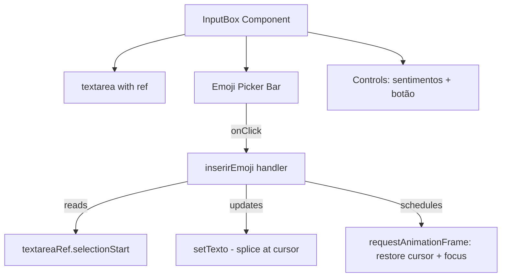

# Design Document: Emoji Picker Bar

## Overview

This enhancement adds an inline emoji picker bar to the existing `InputBox` component. The bar displays a curated set of emoji buttons between the textarea and the controls section. Clicking an emoji inserts it at the current cursor position in the textarea, preserving cursor state across React re-renders.

The design prioritizes minimal complexity — the emoji bar is rendered inline within `InputBox.tsx` (not extracted to a separate component file) since it is tightly coupled to the textarea's cursor state and the component's `texto` state. The emoji data is a static constant array co-located in the same module.

## Architecture

The emoji picker is not a standalone feature — it is a UI enhancement to `InputBox`. The architecture extends the existing component with:

1. A `useRef<HTMLTextAreaElement>` to track the DOM element and read `selectionStart`
2. A static `EMOJIS` constant array with emoji character and label pairs
3. An `inserirEmoji` handler that splices text at cursor position and schedules cursor restoration after React's re-render



### Design Decisions

| Decision | Rationale |
|----------|-----------|
| Inline in InputBox (no separate component file) | Emoji bar is tightly coupled to textarea ref and `texto` state; extracting would require prop drilling or forwarded refs with no real benefit |
| `useRef` for cursor tracking | React doesn't expose controlled cursor position; reading `selectionStart` from the DOM ref is the standard pattern |
| `requestAnimationFrame` for cursor restore | After `setTexto` triggers a re-render, the DOM textarea resets cursor to end; rAF runs after paint, allowing us to set `selectionStart`/`selectionEnd` correctly |
| Static array (not fetched/dynamic) | Emoji set is small, curated, and doesn't change at runtime; no need for lazy loading or external data |
| BEM class naming (`input-box__emoji-*`) | Consistent with existing InputBox.css pattern |

## Components and Interfaces

### Modified: `InputBox` component

New internal elements added to `InputBox.tsx`:

```typescript
// New ref
const textareaRef = useRef<HTMLTextAreaElement>(null);

// New handler
const inserirEmoji = (emoji: string) => { ... };
```

### New constant: `EMOJIS`

```typescript
interface EmojiItem {
  char: string;   // The emoji character (e.g., '❤️')
  label: string;  // Portuguese description for aria-label (e.g., 'Coração')
}

const EMOJIS: EmojiItem[] = [
  { char: '❤️', label: 'Coração' },
  { char: '😢', label: 'Chorando' },
  { char: '😊', label: 'Sorrindo' },
  { char: '🤗', label: 'Abraço' },
  { char: '💪', label: 'Força' },
  { char: '🙏', label: 'Oração' },
  { char: '😤', label: 'Raiva' },
  { char: '😌', label: 'Alívio' },
  { char: '💔', label: 'Coração partido' },
  { char: '🥺', label: 'Suplicante' },
  { char: '✨', label: 'Brilho' },
  { char: '🫂', label: 'Abraçando' },
];
```

### New JSX block: Emoji Picker Bar

Rendered between `<textarea>` and `<div className="input-box__controles">`:

```tsx
<div className="input-box__emoji-bar" role="toolbar" aria-label="Emojis">
  {EMOJIS.map((emoji) => (
    <button
      key={emoji.char}
      type="button"
      className="input-box__emoji-btn"
      onClick={() => inserirEmoji(emoji.char)}
      disabled={isPublicando}
      aria-label={emoji.label}
      title={emoji.label}
    >
      {emoji.char}
    </button>
  ))}
</div>
```

### Handler: `inserirEmoji`

```typescript
const inserirEmoji = (emoji: string) => {
  const textarea = textareaRef.current;
  const cursorPos = textarea?.selectionStart ?? texto.length;

  // Respect max character limit
  if (texto.length + emoji.length > MAX_CARACTERES) return;

  const novoTexto = texto.slice(0, cursorPos) + emoji + texto.slice(cursorPos);
  setTexto(novoTexto);

  // Restore cursor after React re-render
  const novaPosicao = cursorPos + emoji.length;
  requestAnimationFrame(() => {
    if (textarea) {
      textarea.focus();
      textarea.selectionStart = novaPosicao;
      textarea.selectionEnd = novaPosicao;
    }
  });
};
```

## Data Models

### EmojiItem (local interface)

| Field | Type | Description |
|-------|------|-------------|
| `char` | `string` | The emoji character to insert |
| `label` | `string` | Portuguese description for accessibility (aria-label) |

No changes to Firestore data models. Emojis are just characters within the `texto` field of existing `DesabafoDoc` — no schema change needed.

### CSS Classes (new additions to InputBox.css)

| Class | Purpose |
|-------|---------|
| `.input-box__emoji-bar` | Flex container for emoji buttons, wraps on overflow |
| `.input-box__emoji-btn` | Individual emoji button styling |
| `.input-box__emoji-btn:hover:not(:disabled)` | Hover state with subtle scale |
| `.input-box__emoji-btn:disabled` | Disabled state during publish |


## Correctness Properties

*A property is a characteristic or behavior that should hold true across all valid executions of a system — essentially, a formal statement about what the system should do. Properties serve as the bridge between human-readable specifications and machine-verifiable correctness guarantees.*

### Property 1: Emoji insertion preserves surrounding text and places emoji at cursor

*For any* text string of length ≤ 2000 characters, any valid cursor position within [0, text.length], and any emoji from the EMOJIS set: inserting the emoji at that cursor position SHALL produce a result where `result === text.slice(0, cursor) + emoji + text.slice(cursor)` and the new cursor position equals `cursor + emoji.length`.

**Validates: Requirements 2.1, 2.2, 2.3**

### Property 2: Character limit enforcement on emoji insertion

*For any* text string and any emoji from the EMOJIS set: if `text.length + emoji.length > MAX_CARACTERES`, then the insertion SHALL be rejected and the text SHALL remain unchanged. If `text.length + emoji.length <= MAX_CARACTERES`, the insertion SHALL succeed.

**Validates: Requirements 2.5**

### Property 3: Every emoji in the set renders a button with correct aria-label

*For any* emoji item in the EMOJIS array, the rendered emoji picker bar SHALL contain a button element whose `aria-label` attribute equals the emoji's `label` field and whose text content equals the emoji's `char` field.

**Validates: Requirements 3.3, 4.3**

## Error Handling

| Scenario | Handling |
|----------|----------|
| Emoji insertion when text is at max length | `inserirEmoji` silently returns without modifying text — no error feedback needed since this is a soft limit (the textarea `maxLength` attribute already prevents manual typing beyond the limit) |
| `textareaRef.current` is null | Fallback to appending at end: `cursorPos = texto.length` via nullish coalescing (`??`) |
| Emoji button clicked while `isPublicando` | Buttons are disabled via the `disabled` prop — handler won't fire |
| `requestAnimationFrame` fails to restore cursor | Non-critical; user can click to reposition. No error thrown. |

No user-facing error messages are introduced by this enhancement. The existing InputBox error handling for text validation (empty text, max length exceeded on publish) remains unchanged.

## Testing Strategy

### Unit Tests (Jest + React Testing Library)

Example-based tests covering:
- Emoji bar renders with correct structure (role="toolbar", aria-label="Emojis")
- Minimum 8 emoji buttons are rendered
- Emoji bar is positioned between textarea and controls in DOM
- All emoji buttons are disabled when `isPublicando` is true
- Clicking an emoji inserts it into the textarea value
- Textarea maintains focus after emoji insertion
- Tab key can reach and leave the emoji bar (standard button focus)

### Property Tests (Jest + fast-check)

Property-based tests covering the correctness properties above:

- **Property 1**: Generate random strings (length 0–1990), random cursor positions, random emoji selections. Verify the `inserirEmoji` logic produces `text.slice(0, cursor) + emoji + text.slice(cursor)`.
  - Minimum 100 iterations
  - Tag: `Feature: enhance-003-emoji-picker, Property 1: Emoji insertion preserves surrounding text and places emoji at cursor`

- **Property 2**: Generate random strings (length 1990–2000), attempt emoji insertion. Verify text is unchanged when limit would be exceeded, and succeeds otherwise.
  - Minimum 100 iterations
  - Tag: `Feature: enhance-003-emoji-picker, Property 2: Character limit enforcement on emoji insertion`

- **Property 3**: For each emoji in the EMOJIS array, verify a button with matching `aria-label` and text content exists in the rendered component.
  - This is enumerable over the static array (12 items), so a simple loop suffices — but we can also use fast-check to generate random subsets to verify invariance.
  - Tag: `Feature: enhance-003-emoji-picker, Property 3: Every emoji in the set renders a button with correct aria-label`

### Testing Notes

- The `inserirEmoji` function logic (text splicing + cursor math) should be extracted as a pure helper function for easy property testing without DOM:
  ```typescript
  export function inserirEmojiNoTexto(texto: string, emoji: string, cursorPos: number, maxCaracteres: number): { novoTexto: string; novaPosicao: number } | null
  ```
  Returns `null` if insertion would exceed limit, otherwise returns new text and cursor position.

- DOM-level tests (focus restoration, rAF cursor positioning) remain as example-based unit tests since they depend on browser APIs not available in fast-check generators.

- Property tests run with `numRuns: 100` minimum per the project convention.
