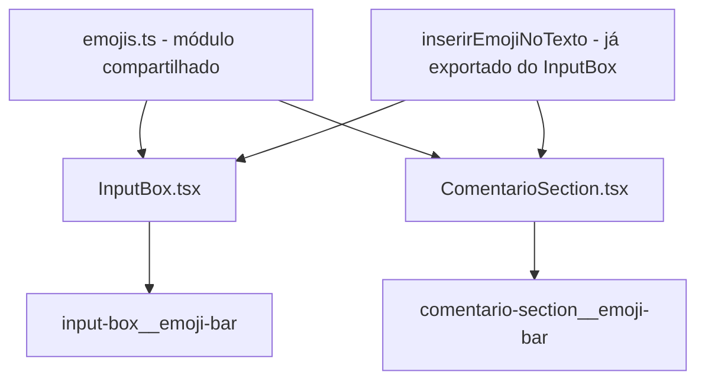

# Design Document: Emoji Expandido e Emoji nos Comentários

## Overview

Este aprimoramento realiza duas mudanças principais:
1. **Expansão do emoji set** — de 12 para ~30 emojis, preenchendo toda a largura do textarea
2. **Emoji picker nos comentários** — adicionar a mesma barra de emojis ao formulário de comentários em `ComentarioSection.tsx`

A abordagem reutiliza a função `inserirEmojiNoTexto` já existente e exportada do `InputBox.tsx`, e extrai o array de emojis para um módulo compartilhado. A Emoji Picker Bar nos comentários segue o mesmo padrão visual/comportamental do InputBox, adaptado ao namespace BEM do ComentarioSection.

## Architecture



### Decisões de Design

| Decisão | Justificativa |
|---------|---------------|
| Extrair EMOJIS para `src/constants/emojis.ts` | O array precisa ser compartilhado entre InputBox e ComentarioSection; evita duplicação |
| Manter `inserirEmojiNoTexto` no InputBox mas importar no ComentarioSection | A função já está exportada e testada; movê-la criaria breaking changes desnecessários |
| Adicionar `useRef<HTMLTextAreaElement>` no ComentarioSection | Necessário para ler `selectionStart` e restaurar cursor após re-render |
| ~30 emojis no set expandido | Preenche a largura de ~600px (largura típica do textarea) com botões de ~32px + gap |
| Mesmo `flex-wrap: wrap` e `gap` da barra existente | Layout responsivo já funciona — wrap automático em telas menores |

## Components and Interfaces

### Novo: `src/constants/emojis.ts`

Módulo compartilhado com o array expandido de emojis:

```typescript
import { EmojiItem } from '../components/InputBox';

export const EMOJIS_EXPANDIDOS: EmojiItem[] = [
  // Amor e carinho
  { char: '❤️', label: 'Coração' },
  { char: '💜', label: 'Coração roxo' },
  { char: '💙', label: 'Coração azul' },
  { char: '🧡', label: 'Coração laranja' },
  { char: '💔', label: 'Coração partido' },
  { char: '🫂', label: 'Abraçando' },
  { char: '🤗', label: 'Abraço' },
  // Tristeza
  { char: '😢', label: 'Chorando' },
  { char: '😭', label: 'Chorando muito' },
  { char: '🥺', label: 'Suplicante' },
  { char: '😞', label: 'Desapontado' },
  { char: '😔', label: 'Pensativo triste' },
  // Raiva e frustração
  { char: '😤', label: 'Raiva' },
  { char: '😡', label: 'Furioso' },
  { char: '🤬', label: 'Palavrão' },
  // Alívio e paz
  { char: '😌', label: 'Alívio' },
  { char: '😊', label: 'Sorrindo' },
  { char: '🙂', label: 'Sorriso leve' },
  { char: '😇', label: 'Anjo' },
  // Força e encorajamento
  { char: '💪', label: 'Força' },
  { char: '🙏', label: 'Oração' },
  { char: '✨', label: 'Brilho' },
  { char: '🌟', label: 'Estrela brilhante' },
  { char: '🔥', label: 'Fogo' },
  // Surpresa e medo
  { char: '😱', label: 'Gritando' },
  { char: '😰', label: 'Ansioso' },
  { char: '😨', label: 'Assustado' },
  { char: '🫣', label: 'Espiando' },
  // Expressões comuns
  { char: '🥰', label: 'Apaixonado' },
  { char: '😴', label: 'Dormindo' },
  { char: '🤔', label: 'Pensando' },
  { char: '👏', label: 'Palmas' },
];
```

### Modificado: `InputBox.tsx`

- Remover o array `EMOJIS` local
- Importar `EMOJIS_EXPANDIDOS` de `../constants/emojis`
- Substituir referência `EMOJIS` por `EMOJIS_EXPANDIDOS` no JSX
- Manter exportação da interface `EmojiItem` e da função `inserirEmojiNoTexto`

```typescript
import { EMOJIS_EXPANDIDOS } from '../constants/emojis';

// No JSX, trocar EMOJIS por EMOJIS_EXPANDIDOS:
{EMOJIS_EXPANDIDOS.map((emoji) => (
  // ... mesmo padrão existente
))}
```

### Modificado: `ComentarioSection.tsx`

Adições ao componente:

```typescript
import { useRef } from 'react'; // adicionar useRef ao import existente
import { EMOJIS_EXPANDIDOS } from '../constants/emojis';
import { inserirEmojiNoTexto } from './InputBox';

// Dentro do componente:
const textareaRef = useRef<HTMLTextAreaElement>(null);

const inserirEmoji = (emoji: string) => {
  const textarea = textareaRef.current;
  const cursorPos = textarea?.selectionStart ?? texto.length;

  const resultado = inserirEmojiNoTexto(texto, emoji, cursorPos, MAX_CARACTERES_COMENTARIO);
  if (!resultado) return;

  setTexto(resultado.novoTexto);

  requestAnimationFrame(() => {
    if (textarea) {
      textarea.focus();
      textarea.selectionStart = resultado.novaPosicao;
      textarea.selectionEnd = resultado.novaPosicao;
    }
  });
};
```

Novo JSX (entre textarea e controles do formulário):

```tsx
<textarea
  ref={textareaRef}
  // ... props existentes
/>

<div className="comentario-section__emoji-bar" role="toolbar" aria-label="Emojis">
  {EMOJIS_EXPANDIDOS.map((emoji) => (
    <button
      key={emoji.char}
      type="button"
      className="comentario-section__emoji-btn"
      onClick={() => inserirEmoji(emoji.char)}
      disabled={isPublicando}
      aria-label={emoji.label}
      title={emoji.label}
    >
      {emoji.char}
    </button>
  ))}
</div>
```

### CSS: Novas classes em `ComentarioSection.css`

```css
.comentario-section__emoji-bar {
  display: flex;
  flex-wrap: wrap;
  gap: 0.375rem;
  padding: 0.25rem 0;
}

.comentario-section__emoji-btn {
  background: transparent;
  border: none;
  font-size: 1.25rem;
  line-height: 1;
  padding: 0.25rem;
  border-radius: 6px;
  cursor: pointer;
  transition: var(--transicao-padrao);
}

.comentario-section__emoji-btn:hover:not(:disabled) {
  transform: scale(1.2);
  background-color: var(--cor-superficie-alt);
}

.comentario-section__emoji-btn:disabled {
  opacity: 0.5;
  cursor: not-allowed;
}
```

## Data Models

Nenhuma alteração nos modelos do Firestore. Emojis são apenas caracteres dentro do campo `texto` de `DesabafoDoc` e `Comentario` — nenhuma mudança de schema necessária.

### Novo módulo: `src/constants/emojis.ts`

| Export | Tipo | Descrição |
|--------|------|-----------|
| `EMOJIS_EXPANDIDOS` | `EmojiItem[]` | Array com ~32 emojis organizados por categoria |

## Correctness Properties

### Property 1: Inserção de emoji preserva texto ao redor e posiciona emoji no cursor

*Para qualquer* texto de comprimento ≤ limite máximo, qualquer posição de cursor válida dentro de [0, texto.length], e qualquer emoji do EMOJIS_EXPANDIDOS: inserir o emoji naquela posição SHALL produzir `texto.slice(0, cursor) + emoji + texto.slice(cursor)` e a nova posição do cursor SHALL ser `cursor + emoji.length`.

**Validates: Requirements 2.2, 2.3, 3.3**

### Property 2: Enforcement do limite de caracteres na inserção de emoji

*Para qualquer* texto e qualquer emoji do EMOJIS_EXPANDIDOS: se `texto.length + emoji.length > maxCaracteres`, a inserção SHALL ser rejeitada (retorna null). Se `texto.length + emoji.length <= maxCaracteres`, a inserção SHALL ser bem-sucedida.

**Validates: Requirements 2.5, 3.2**

### Property 3: Conjunto de emojis compartilhado é idêntico entre componentes

*Para qualquer* renderização do InputBox e do ComentarioSection, o array de emojis exibido SHALL ser o mesmo `EMOJIS_EXPANDIDOS` — garantindo consistência via importação do mesmo módulo.

**Validates: Requirements 1.3, 5.3**

### Property 4: Todos os emojis do set expandido renderizam botões com aria-label correto

*Para qualquer* emoji no array EMOJIS_EXPANDIDOS, o componente renderizado SHALL conter um botão cujo atributo `aria-label` é igual ao campo `label` do emoji e cujo conteúdo de texto é igual ao campo `char`.

**Validates: Requirements 4.2**

## Error Handling

| Cenário | Tratamento |
|---------|------------|
| Inserção de emoji quando texto está no limite máximo | `inserirEmojiNoTexto` retorna `null`; handler retorna sem modificar texto |
| `textareaRef.current` é null no ComentarioSection | Fallback para append no final: `cursorPos = texto.length` via `??` |
| Botão de emoji clicado durante `isPublicando` | Botões desabilitados via prop `disabled` — handler não dispara |
| `requestAnimationFrame` falha em restaurar cursor | Não-crítico; usuário pode clicar para reposicionar |

## Testing Strategy

### Testes Unitários (Jest + React Testing Library)

- ComentarioSection renderiza emoji-bar com role="toolbar" e aria-label="Emojis" quando usuário autenticado
- Clicar emoji no ComentarioSection insere no textarea
- Emoji buttons desabilitados durante isPublicando no ComentarioSection
- InputBox renderiza todos os emojis do EMOJIS_EXPANDIDOS (mínimo 25)
- EMOJIS_EXPANDIDOS contém emojis de todas as categorias requeridas

### Testes de Propriedade (Jest + fast-check)

- **Propriedade 1**: Gerar strings aleatórias (0–490 chars para comentário, 0–1990 para desabafo), posições de cursor aleatórias, seleção aleatória de emoji. Verificar que `inserirEmojiNoTexto` produz resultado correto.
- **Propriedade 2**: Gerar strings próximas ao limite (490–500 para comentário, 1990–2000 para desabafo), verificar rejeição/aceitação correta.
- **Propriedade 4**: Para cada emoji no EMOJIS_EXPANDIDOS, verificar presença do botão com aria-label correto nos componentes renderizados.
