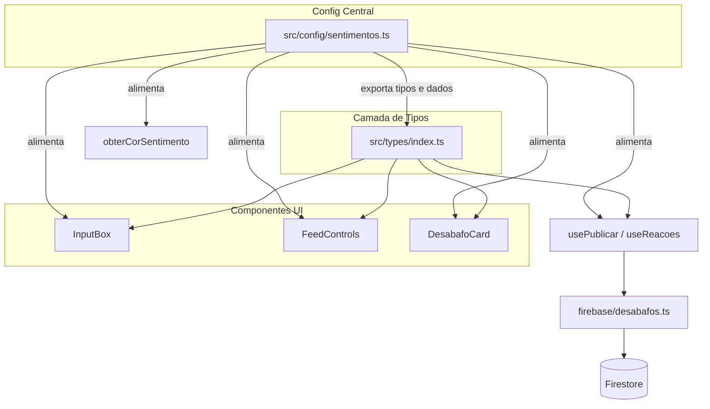

# Design Document

## Overview

Este design descreve a refatoração do sistema de sentimentos e reações do "Desabafo Anônimo" para substituir os 3 sentimentos e 3 reações hardcoded por 15 sentimentos (categorizados em "Dramas" e "Good Vibes") e 8 reações no estilo internet brasileira, todos dirigidos por um arquivo de configuração centralizado.

A decisão central é criar um módulo `src/config/sentimentos.ts` que serve como **single source of truth**. Tipos TypeScript são derivados automaticamente via `keyof typeof`, eliminando duplicação e garantindo que adicionar/remover opções exige alteração apenas no config. Componentes, hooks e regras do Firestore operam genericamente sobre o config.

### Decisões de Design

| Decisão | Justificativa |
|---------|---------------|
| Config como `as const` + `keyof typeof` | Type-safety sem duplicação; compilador sinaliza inconsistências |
| Firestore rules genéricas (sem enum) | Evita redeploy ao alterar config; validação semântica no client |
| Cor baseada em categoria (não por sentimento) | Escalável — 15 sentimentos com 2 cores vs. 15 mapeamentos individuais |
| Fallback para docs legados | Zero downtime; não requer migração de dados |
| `Record<TipoReacao, number>` | Tipagem genérica elimina campos hardcoded nas interfaces |

## Architecture



### Fluxo de dados

1. `src/config/sentimentos.ts` define `SENTIMENTO_CONFIG` e `REACAO_CONFIG` como objetos `as const`
2. Tipos `Sentimento` e `TipoReacao` são exportados desse módulo via `keyof typeof`
3. `src/types/index.ts` re-exporta os tipos e usa `Record<TipoReacao, number>` nas interfaces
4. Componentes importam o config para iterar e renderizar dinamicamente
5. Hooks usam o config para inicializar e validar
6. Firestore rules validam genericamente (string 1-100, map com int≥0)

## Components and Interfaces

### 1. Módulo de Configuração (`src/config/sentimentos.ts`)

```typescript
// Estrutura de cada sentimento
interface SentimentoEntry {
  label: string;
  emoji: string;
  categoria: 'dramas' | 'good_vibes';
}

// Estrutura de cada reação
interface ReacaoEntry {
  label: string;
  emoji: string;
}

export const SENTIMENTO_CONFIG = {
  meus_olhos_tao_tremendo: { label: 'Meus olhos tão tremendo', emoji: '😤', categoria: 'dramas' },
  surto_controlado: { label: 'Surto controlado', emoji: '🤯', categoria: 'dramas' },
  joguei_no_ventilador: { label: 'Joguei no ventilador', emoji: '💩', categoria: 'dramas' },
  indiretinha: { label: 'Indiretinha', emoji: '🙄', categoria: 'dramas' },
  desaforo: { label: 'Desaforo', emoji: '😠', categoria: 'dramas' },
  mimimi_legitimo: { label: 'Mimimi legítimo', emoji: '🥲', categoria: 'dramas' },
  to_de_saco_cheio: { label: 'Tô de saco cheio', emoji: '😩', categoria: 'dramas' },
  choro_facil: { label: 'Choro fácil', emoji: '😭', categoria: 'dramas' },
  foi_pra_conta: { label: 'Foi pra conta', emoji: '🌋', categoria: 'dramas' },
  good_vibes: { label: 'Good vibes', emoji: '✨', categoria: 'good_vibes' },
  apaixonado: { label: 'Apaixonado', emoji: '🥰', categoria: 'good_vibes' },
  crush: { label: 'Crush', emoji: '🫦', categoria: 'good_vibes' },
  cupido_acertou: { label: 'Cupido acertou', emoji: '💘', categoria: 'good_vibes' },
  final_feliz: { label: 'Final feliz', emoji: '🎉', categoria: 'good_vibes' },
  relaxado: { label: 'Relaxado', emoji: '😎', categoria: 'good_vibes' },
} as const satisfies Record<string, SentimentoEntry>;

export const REACAO_CONFIG = {
  quem_nunca: { label: 'Quem nunca', emoji: '🙋' },
  nao_julgo: { label: 'Não julgo', emoji: '🤷' },
  se_ja_fiz_nao_me_lembro: { label: 'Se já fiz não me lembro', emoji: '🫣' },
  tomara_que_passe: { label: 'Tomara que passe', emoji: '🤞' },
  eu_ia_pior: { label: 'Eu ia pior', emoji: '📈' },
  respira_fundo: { label: 'Respira fundo', emoji: '🧘' },
  to_rindo_mas_e_de_nervoso: { label: 'Tô rindo mas é de nervoso', emoji: '😅' },
} as const satisfies Record<string, ReacaoEntry>;

// Tipos derivados automaticamente
export type Sentimento = keyof typeof SENTIMENTO_CONFIG;
export type TipoReacao = keyof typeof REACAO_CONFIG;

// Helpers derivados
export type CategoriaSentimento = 'dramas' | 'good_vibes';

export const CATEGORIAS: Record<CategoriaSentimento, string> = {
  dramas: 'Dramas',
  good_vibes: 'Good Vibes',
};

// Helper: agrupar sentimentos por categoria (preserva ordem do config)
export function sentimentosPorCategoria(): Record<CategoriaSentimento, Sentimento[]> {
  const resultado: Record<CategoriaSentimento, Sentimento[]> = { dramas: [], good_vibes: [] };
  for (const [chave, entry] of Object.entries(SENTIMENTO_CONFIG)) {
    resultado[entry.categoria].push(chave as Sentimento);
  }
  return resultado;
}

// Helper: inicializar objeto de reações com zeros
export function criarReacoesIniciais(): Record<TipoReacao, number> {
  const reacoes = {} as Record<TipoReacao, number>;
  for (const chave of Object.keys(REACAO_CONFIG)) {
    reacoes[chave as TipoReacao] = 0;
  }
  return reacoes;
}

// Helper: validar se string é sentimento válido
export function isSentimentoValido(valor: string): valor is Sentimento {
  return valor in SENTIMENTO_CONFIG;
}

// Helper: obter info de sentimento com fallback para legados
export function obterInfoSentimento(valor: string): { label: string; emoji: string; categoria: CategoriaSentimento | null } {
  if (isSentimentoValido(valor)) {
    const entry = SENTIMENTO_CONFIG[valor];
    return { label: entry.label, emoji: entry.emoji, categoria: entry.categoria };
  }
  return { label: 'Sentimento antigo', emoji: '❓', categoria: null };
}

// Helper: normalizar reações de documento (preencher ausentes com 0, ignorar obsoletas)
export function normalizarReacoes(docReacoes: Record<string, number> | undefined): Record<TipoReacao, number> {
  const resultado = criarReacoesIniciais();
  if (docReacoes) {
    for (const chave of Object.keys(REACAO_CONFIG)) {
      if (chave in docReacoes) {
        resultado[chave as TipoReacao] = docReacoes[chave] ?? 0;
      }
    }
  }
  return resultado;
}
```

### 2. Tipos atualizados (`src/types/index.ts`)

Remover as union types hardcoded e importar do config:

```typescript
import { Sentimento, TipoReacao } from '../config/sentimentos';
export type { Sentimento, TipoReacao };

export interface DesabafoDoc {
  texto: string;
  sentimento: Sentimento;
  criadoEm: Timestamp;
  uid: string;
  reacoes: Record<TipoReacao, number>;
  totalComentarios: number;
  numero?: number;
}

export interface Desabafo {
  id: string;
  texto: string;
  sentimento: string; // string para suportar valores legados na leitura
  criadoEm: Date;
  reacoes: Record<TipoReacao, number>;
  totalComentarios: number;
  numero?: number;
}
```

Nota: O campo `sentimento` em `Desabafo` (modelo de leitura) é declarado como `string` para suportar documentos legados sem causar erro de tipo. A validação semântica ocorre via `obterInfoSentimento()`.

### 3. InputBox — Seleção de sentimento agrupado

O componente importa `SENTIMENTO_CONFIG`, `sentimentosPorCategoria()` e `CATEGORIAS` para renderizar dinamicamente. Estado inicial: `sentimento = null` (nenhum pré-selecionado).

```typescript
const [sentimento, setSentimento] = useState<Sentimento | null>(null);

// Validação antes de publicar:
if (!sentimento) {
  mostrarFeedback('erro', 'Selecione um sentimento antes de publicar!');
  return;
}
```

Renderização:
```tsx
{Object.entries(sentimentosPorCategoria()).map(([cat, chaves]) => (
  <div key={cat} className="input-box__sentimento-grupo">
    <span className="input-box__sentimento-categoria">{CATEGORIAS[cat]}</span>
    {chaves.map((chave) => {
      const entry = SENTIMENTO_CONFIG[chave];
      return (
        <button
          key={chave}
          aria-pressed={sentimento === chave}
          className={`input-box__sentimento-btn ${sentimento === chave ? 'input-box__sentimento-btn--ativo' : ''}`}
          onClick={() => setSentimento(chave)}
        >
          <span>{entry.emoji}</span>
          <span>{entry.label}</span>
        </button>
      );
    })}
  </div>
))}
```

### 4. DesabafoCard — Reações dinâmicas

O componente itera sobre `REACAO_CONFIG` em vez de renderizar botões hardcoded:

```tsx
{Object.entries(REACAO_CONFIG).map(([chave, entry]) => (
  <button
    key={chave}
    className={`desabafo-card__reacao-btn ${reacaoAtiva === chave ? 'desabafo-card__reacao-btn--ativo' : ''}`}
    onClick={() => handleReagir(chave as TipoReacao)}
    aria-label={entry.label}
    aria-pressed={reacaoAtiva === chave}
  >
    <span className="desabafo-card__reacao-emoji">{entry.emoji}</span>
    <span className="desabafo-card__reacao-label">{entry.label}</span>
    <span className="desabafo-card__reacao-contador">{desabafo.reacoes[chave as TipoReacao] ?? 0}</span>
  </button>
))}
```

### 5. FeedControls — Filtro com categorias

O select renderiza optgroups derivados do config:

```tsx
<select value={filtroAtivo} onChange={handleFiltroChange} aria-label="Filtrar por sentimento">
  <option value="todos">Todos</option>
  {Object.entries(sentimentosPorCategoria()).map(([cat, chaves]) => (
    <optgroup key={cat} label={CATEGORIAS[cat]}>
      {chaves.map((chave) => (
        <option key={chave} value={chave}>
          {SENTIMENTO_CONFIG[chave].emoji} {SENTIMENTO_CONFIG[chave].label}
        </option>
      ))}
    </optgroup>
  ))}
</select>
```

### 6. obterCorSentimento — Cor por categoria

```typescript
import { SENTIMENTO_CONFIG, CategoriaSentimento } from '../config/sentimentos';

const CORES_CATEGORIA: Record<CategoriaSentimento, string> = {
  dramas: 'var(--cor-dramas)',
  good_vibes: 'var(--cor-good-vibes)',
};

const COR_LEGADO = 'var(--cor-neutro)';

export function obterCorSentimento(sentimento: string): string {
  if (sentimento in SENTIMENTO_CONFIG) {
    const cat = SENTIMENTO_CONFIG[sentimento as keyof typeof SENTIMENTO_CONFIG].categoria;
    return CORES_CATEGORIA[cat];
  }
  return COR_LEGADO;
}
```

### 7. usePublicar — Inicialização via config

```typescript
import { criarReacoesIniciais } from '../config/sentimentos';

// No retorno após criar:
const novoDesabafo: Desabafo = {
  id,
  texto,
  sentimento,
  criadoEm: new Date(),
  reacoes: criarReacoesIniciais(),
  totalComentarios: 0,
};
```

### 8. firebase/desabafos.ts — criarDesabafo

```typescript
import { criarReacoesIniciais } from '../config/sentimentos';

// Dentro da transação:
transaction.set(novoDesabafoRef, {
  texto,
  sentimento,
  uid,
  criadoEm: serverTimestamp(),
  reacoes: criarReacoesIniciais(),
  totalComentarios: 0,
  numero,
});
```

### 9. Leitura com normalização (buscarDesabafos)

```typescript
import { normalizarReacoes } from '../config/sentimentos';

// Na conversão do documento:
reacoes: normalizarReacoes(data.reacoes as Record<string, number>),
```

## Data Models

### Firestore Document (`desabafos/{id}`)

```
{
  texto: string,               // 1-2000 chars
  sentimento: string,          // chave do SENTIMENTO_CONFIG (1-100 chars nas rules)
  uid: string,                 // Firebase Auth uid
  criadoEm: Timestamp,        // serverTimestamp
  reacoes: {                   // Map<string, int>
    quem_nunca: 0,
    nao_julgo: 0,
    se_ja_fiz_nao_me_lembro: 0,
    tomara_que_passe: 0,
    eu_ia_pior: 0,
    respira_fundo: 0,
    chama_no_particular: 0,
    to_rindo_mas_e_de_nervoso: 0
  },
  totalComentarios: number,
  numero: number
}
```

### Firestore Rules (trecho atualizado)

```
allow create: if isAuthenticated()
  && request.resource.data.texto is string
  && request.resource.data.texto.size() >= 1
  && request.resource.data.texto.size() <= 2000
  && request.resource.data.sentimento is string
  && request.resource.data.sentimento.size() >= 1
  && request.resource.data.sentimento.size() <= 100
  && request.resource.data.uid == request.auth.uid
  && request.resource.data.reacoes is map
  && request.resource.data.reacoes.size() > 0
  && request.resource.data.totalComentarios == 0;

allow update: if request.resource.data.texto == resource.data.texto
  && request.resource.data.sentimento == resource.data.sentimento
  && request.resource.data.criadoEm == resource.data.criadoEm
  && request.resource.data.uid == resource.data.uid;
```

### Compatibilidade com documentos legados

| Cenário | Comportamento |
|---------|---------------|
| `sentimento: "triste"` (antigo) | `obterInfoSentimento` retorna `{ label: "Sentimento antigo", emoji: "❓", categoria: null }` |
| `reacoes: { apoio: 5, forca: 3, pouco: 1 }` (antigo) | `normalizarReacoes` ignora chaves antigas, retorna todas as novas com 0 |
| `reacoes: { quem_nunca: 2 }` (parcial, novo) | `normalizarReacoes` mantém `quem_nunca: 2`, preenche restantes com 0 |

## Correctness Properties

*Uma propriedade é uma característica ou comportamento que deve ser verdadeiro em todas as execuções válidas de um sistema — essencialmente, uma declaração formal sobre o que o sistema deve fazer. Propriedades servem como ponte entre especificações legíveis por humanos e garantias de correção verificáveis por máquina.*

### Property 1: Integridade do schema de configuração

*Para qualquer* chave no `SENTIMENTO_CONFIG`, a entrada deve possuir `label` (string não vazia), `emoji` (string não vazia) e `categoria` (exatamente "dramas" ou "good_vibes"). *Para qualquer* chave no `REACAO_CONFIG`, a entrada deve possuir `label` (string não vazia) e `emoji` (string não vazia).

**Validates: Requirements 1.1, 1.2**

### Property 2: Renderização de sentimentos dirigida pelo config

*Para qualquer* estado do `SENTIMENTO_CONFIG`, o InputBox deve renderizar exatamente os sentimentos presentes no config, agrupados por categoria na ordem definida, exibindo o emoji e label de cada entrada.

**Validates: Requirements 1.4, 2.3, 6.1, 6.2**

### Property 3: Renderização de reações dirigida pelo config

*Para qualquer* estado do `REACAO_CONFIG`, o DesabafoCard deve renderizar exatamente os botões de reação presentes no config, na mesma ordem, com emoji e label correspondentes.

**Validates: Requirements 1.5, 3.2, 3.7**

### Property 4: Exclusividade de seleção de sentimento

*Para qualquer* sequência de seleções de sentimento no InputBox, apenas o último sentimento selecionado deve estar ativo (aria-pressed=true), e todos os demais devem estar inativos.

**Validates: Requirements 2.5, 6.3, 6.6**

### Property 5: Incremento de reação (optimistic)

*Para qualquer* desabafo com contadores arbitrários e qualquer reação não previamente selecionada pelo usuário, clicar nessa reação deve incrementar seu contador em exatamente 1, mantendo todos os demais contadores inalterados.

**Validates: Requirements 3.3**

### Property 6: Troca de reação (swap)

*Para qualquer* desabafo com uma reação ativa e qualquer reação diferente da ativa, trocar de reação deve decrementar a anterior em 1, incrementar a nova em 1, e manter todos os demais contadores inalterados.

**Validates: Requirements 3.4**

### Property 7: Idempotência de re-clique na mesma reação

*Para qualquer* desabafo com uma reação já ativa, clicar na mesma reação não deve alterar nenhum contador nem o estado visual.

**Validates: Requirements 3.5**

### Property 8: Inicialização de reações a partir do config

*Para qualquer* `REACAO_CONFIG`, ao criar um novo desabafo, o campo `reacoes` deve conter exatamente as chaves presentes no config, cada uma com valor inteiro zero, sem chaves extras ou ausentes.

**Validates: Requirements 4.1**

### Property 9: Normalização de reações na leitura (resiliência)

*Para qualquer* documento do Firestore contendo um subconjunto arbitrário de chaves de reação (incluindo chaves obsoletas), a função `normalizarReacoes` deve retornar um objeto com exatamente as chaves do `REACAO_CONFIG` atual, onde chaves presentes no documento mantêm seu valor e chaves ausentes recebem zero. Chaves obsoletas são ignoradas.

**Validates: Requirements 4.3, 4.5, 9.5**

### Property 10: Filtro de sentimento no feed

*Para qualquer* lista de desabafos com sentimentos variados e qualquer sentimento válido selecionado como filtro, a lista resultante deve conter apenas desabafos com o sentimento correspondente. Quando o filtro é "todos", a lista deve conter todos os desabafos sem distinção.

**Validates: Requirements 7.3, 7.4**

### Property 11: Cor derivada da categoria

*Para qualquer* sentimento presente no `SENTIMENTO_CONFIG`, `obterCorSentimento` deve retornar a cor correspondente à categoria desse sentimento. Para qualquer string que não é chave do config, deve retornar a cor neutra de fallback.

**Validates: Requirements 9.3, 9.4**

## Error Handling

| Cenário | Estratégia |
|---------|-----------|
| Publicar sem sentimento selecionado | InputBox impede submissão e exibe feedback de erro |
| Sentimento inválido no código | Compilador TypeScript rejeita — `Sentimento` é tipo derivado |
| Firestore rejeita escrita | Hook `usePublicar` captura erro e exibe mensagem genérica |
| Reação falha no Firestore | `useReacoes` faz rollback otimista (restaura contadores) |
| Documento legado com sentimento antigo | `obterInfoSentimento` retorna fallback sem crash |
| Documento legado com reações antigas | `normalizarReacoes` ignora chaves obsoletas |
| Config com categoria desconhecida | TypeScript `satisfies` impede em tempo de compilação |
| FeedControls sem resultados para filtro | Feed exibe mensagem "Nenhum desabafo para este sentimento" |

## Testing Strategy

### Abordagem dupla

O projeto usa **Jest** como test runner e **fast-check** (já instalado) para property-based testing.

#### Testes de propriedade (PBT)

Cada propriedade do design será implementada como um teste com `fast-check`, executando no mínimo 100 iterações.

- **Property 1**: Gerar chaves aleatórias, verificar schema do config real
- **Property 2**: Renderizar InputBox, verificar que todos os sentimentos do config estão presentes com agrupamento
- **Property 3**: Renderizar DesabafoCard com reações aleatórias, verificar botões gerados do config
- **Property 4**: Gerar sequência aleatória de cliques em sentimentos, verificar que apenas 1 está ativo
- **Property 5**: Gerar desabafo com contadores aleatórios + reação aleatória não selecionada, verificar incremento
- **Property 6**: Gerar desabafo com reação ativa + reação diferente, verificar swap
- **Property 7**: Gerar desabafo com reação ativa, re-clicar, verificar nenhuma mudança
- **Property 8**: Verificar que `criarReacoesIniciais()` sempre retorna todas as chaves com 0
- **Property 9**: Gerar objetos com subconjuntos aleatórios de chaves (incluindo obsoletas), verificar normalização
- **Property 10**: Gerar lista de desabafos com sentimentos aleatórios, aplicar filtro, verificar resultado
- **Property 11**: Para cada chave do config, verificar cor = cor da categoria; para strings aleatórias não no config, verificar fallback

#### Testes unitários (exemplos e edge cases)

- Conteúdo exato dos 15 sentimentos (valores, emojis, labels) — Req 2.1, 2.2
- Conteúdo exato das 8 reações — Req 3.1
- InputBox inicia sem sentimento selecionado — Req 6.4
- Publicar sem sentimento exibe erro — Req 6.5
- FeedControls tem "Todos" como primeira opção selecionada por padrão — Req 7.2
- Feed exibe mensagem quando filtro retorna vazio — Req 7.6

#### Testes de integração (Firestore rules)

- Firestore aceita sentimento string 1-100 chars — Req 8.1
- Firestore aceita reacoes como map com inteiros ≥ 0 — Req 8.2, 8.5
- Firestore mantém validações de auth, tamanho, imutabilidade — Req 8.4

### Configuração dos testes de propriedade

```typescript
// Tag format para cada teste:
// Feature: enhance-005-fun-sentiments-reactions, Property {N}: {título}

fc.assert(
  fc.property(/* arbitraries */, (input) => {
    // verificação
  }),
  { numRuns: 100 }
);
```

### Arquivos de teste

- `src/__tests__/properties/sentimentosConfig.property.test.ts` — Properties 1, 8, 9, 11
- `src/__tests__/properties/sentimentoSelecao.property.test.tsx` — Properties 2, 4
- `src/__tests__/properties/reacaoCard.property.test.tsx` — Properties 3, 5, 6, 7
- `src/__tests__/properties/feedFiltro.property.test.ts` — Property 10
- `src/__tests__/unit/sentimentosConfig.test.ts` — Testes de exemplo (conteúdo exato)
- `src/__tests__/unit/InputBox.test.tsx` — Atualizar para novo comportamento
- `src/__tests__/unit/FeedControls.test.tsx` — Atualizar para novo comportamento
- `src/__tests__/unit/DesabafoCard.test.tsx` — Atualizar para novo comportamento
