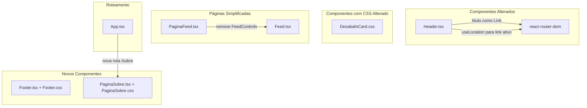

# Design Document

## Overview

Este design descreve as alterações de UI/UX e navegação no projeto "Desabafo Anônimo". O escopo cobre seis melhorias: título do Header como link para a home, criação de um componente Footer, criação da página Sobre, destaque visual do link ativo no Header, ênfase no texto do DesabafoCard, e simplificação da PaginaFeed removendo o filtro de sentimento.

Todas as mudanças seguem os padrões existentes do projeto: React com TypeScript, React Router para navegação, CSS com BEM naming e custom properties, e componentes funcionais.

## Architecture

As mudanças são localizadas na camada de apresentação (componentes e páginas). Não há alterações no backend (Firebase/Firestore), hooks de dados, ou lógica de negócio.



## Components and Interfaces

### Header (Modificado)

**Arquivo:** `src/components/Header.tsx`

Mudanças:
1. O título `<h1>` será envolvido em um `<Link to="/">` do react-router-dom
2. Importar `useLocation` para determinar a rota atual
3. Aplicar a classe BEM `header__link-nav--ativo` ao link que corresponde à rota atual

```typescript
interface HeaderProps {
  isAdmin?: boolean;
  children?: React.ReactNode;
}
```

**Lógica de link ativo:**
- Usa `useLocation().pathname` para obter a rota atual
- Compara com os `to` props de cada `<Link>` de navegação
- Usa `pathname.startsWith(linkPath)` para matching (ex: `/feed` ativo quando em `/feed`)
- Links de navegação conhecidos: `/feed`, `/trends`, `/moderacao`

### Footer (Novo)

**Arquivo:** `src/components/Footer.tsx` + `src/components/Footer.css`

```typescript
// Sem props — componente puramente apresentacional
export function Footer(): JSX.Element
```

**Estrutura HTML:**
```html
<footer class="footer">
  <div class="footer__conteudo">
    <span class="footer__copyright">© {anoAtual} Desabafo Anônimo</span>
    <Link to="/sobre" class="footer__link">Sobre</Link>
  </div>
</footer>
```

**Decisão de design:** O Footer não recebe props pois seu conteúdo é estático (exceto o ano dinâmico via `new Date().getFullYear()`). Isso mantém o componente simples e reutilizável em todas as páginas sem acoplamento.

### PaginaSobre (Novo)

**Arquivo:** `src/pages/PaginaSobre.tsx` + `src/pages/PaginaSobre.css`

```typescript
export function PaginaSobre(): JSX.Element
```

**Estrutura:**
- Header (com LoginButton como nas outras páginas)
- Conteúdo principal: título "Sobre o Desabafo Anônimo", parágrafos descritivos, e aviso sobre ajuda profissional
- Footer

**Decisão de design:** Segue o mesmo padrão de layout das páginas existentes (PaginaTrends, PaginaDesabafo) com Header no topo. O Footer é adicionado ao final.

### DesabafoCard (CSS Modificado)

**Arquivo:** `src/components/DesabafoCard.css`

Alterações apenas no CSS da classe `.desabafo-card__texto`:
- `font-size: 1.125rem` (aumento de 1rem para 1.125rem)
- `border: 1px solid var(--cor-borda)`
- `border-radius: 8px`
- `padding: 0.75rem`
- `min-height: 120px`
- Manter `line-height: 1.6`, `word-break: break-word`, `white-space: pre-wrap`
- Sem `overflow: hidden` (texto expande verticalmente)

**Decisão de design:** O componente TypeScript não muda — apenas o CSS é alterado. Isso minimiza o impacto e risco da mudança.

### PaginaFeed (Simplificada)

**Arquivo:** `src/pages/PaginaFeed.tsx`

Remoções:
- Import e uso de `FeedControls`
- Estado `filtro` e handler `handleFiltroChange`
- Prop `totalDesabafos` não mais necessária

Mudanças:
- `useDesabafos('todos')` chamado diretamente com valor fixo
- Apenas o componente `Feed` é renderizado (sem `FeedControls`)

### App.tsx (Rota Adicionada)

**Arquivo:** `src/App.tsx`

Adição:
- Import de `PaginaSobre`
- Nova `<Route path="/sobre" element={<PaginaSobre />} />`

### Footer em Todas as Páginas

O Footer será adicionado em:
- `PaginaFeed` (rota `/feed`)
- `PaginaTrends` (rota `/trends`)
- `PaginaDesabafo` (rota `/desabafo/:numero`)
- `PaginaSobre` (rota `/sobre`)
- `PaginaFeed` na raiz (`/`) — componente dentro de App.tsx
- `PaginaModeracao` (rota `/moderacao`)

**Decisão de design:** O Footer é adicionado individualmente em cada página em vez de no nível do layout em App.tsx, pois o projeto não usa um componente de layout compartilhado. Isso mantém consistência com o padrão existente onde cada página compõe Header + conteúdo.

## Data Models

Não há alterações em modelos de dados. As mudanças são puramente na camada de apresentação.

Os tipos existentes relevantes não são modificados:
- `HeaderProps` — pode manter a interface atual (isAdmin, children)
- `Desabafo` — sem mudanças
- `FeedControlsProps` — não mais utilizado na PaginaFeed

## Correctness Properties

*A property is a characteristic or behavior that should hold true across all valid executions of a system—essentially, a formal statement about what the system should do. Properties serve as the bridge between human-readable specifications and machine-verifiable correctness guarantees.*

### Property 1: Active link correctness

*For any* route in the application, if the route matches one of the known navigation link paths (`/feed`, `/trends`, `/moderacao`), then exactly one navigation link element SHALL have the `header__link-nav--ativo` class, and it SHALL be the link whose `to` prop matches the current route. If the route does not match any navigation link path (e.g., `/`, `/sobre`, `/desabafo/123`), then no navigation link element SHALL have the active modifier class.

**Validates: Requirements 4.1, 4.3, 4.4, 4.5**

## Error Handling

Esta melhoria não introduz novos cenários de erro significativos:

| Cenário | Tratamento |
|---------|-----------|
| Rota `/sobre` não encontrada | React Router já renderiza o componente — se o usuário acessa uma rota inexistente, o comportamento existente (sem 404 handler) não é alterado neste escopo |
| Footer não renderiza o ano | Improvável — `new Date().getFullYear()` é síncrono e confiável. Sem tratamento especial necessário |
| Link ativo não corresponde | Fallback seguro: se `useLocation().pathname` não corresponder a nenhum link, nenhum link recebe a classe ativa (comportamento por design, req 4.5) |
| PaginaFeed sem filtro retorna erro do hook | O tratamento de erro existente em `useDesabafos` é preservado — a mensagem de erro e botão "Tentar novamente" continuam renderizados |

## Testing Strategy

### Abordagem Dual: Testes Unitários + Testes de Propriedade

**Testes Unitários (Jest + Testing Library):**
- Header: verificar que o título é um link para "/", que a classe ativa é aplicada corretamente para rotas específicas
- Footer: verificar conteúdo (©, ano, nome), presença do link "/sobre", elemento semântico `<footer>`
- PaginaSobre: verificar renderização do título, texto descritivo, aviso profissional, presença do Header e Footer
- PaginaFeed: verificar ausência de FeedControls, presença de Feed com props corretos
- DesabafoCard: snapshot test para verificar que as classes CSS são aplicadas (os estilos são testados visualmente)

**Testes de Propriedade (fast-check):**
- **Property 1**: Active link correctness — gerar rotas aleatórias (do conjunto de rotas conhecidas + rotas arbitrárias que não correspondem) e verificar o invariante de link ativo no Header

**Configuração dos testes de propriedade:**
- Biblioteca: `fast-check` (já instalada no projeto)
- Mínimo 100 iterações por teste
- Tag: **Feature: enhance-006-ui-polish-navigation, Property 1: Active link correctness**

**Testes que NÃO são necessários como property-based:**
- Requisitos de CSS/estilo (reqs 1.3, 1.4, 5.1–5.5): verificados visualmente ou via snapshot
- Conteúdo estático do Footer/PaginaSobre (reqs 2.1, 2.2, 3.2, 3.5): exemplos específicos
- Remoção do FeedControls (req 6): verificação de ausência pontual

**Testes de integração:**
- Verificar que o Footer aparece em todas as rotas da aplicação (req 2.3)
- Verificar navegação end-to-end: clicar no link "Sobre" no Footer navega para `/sobre`
