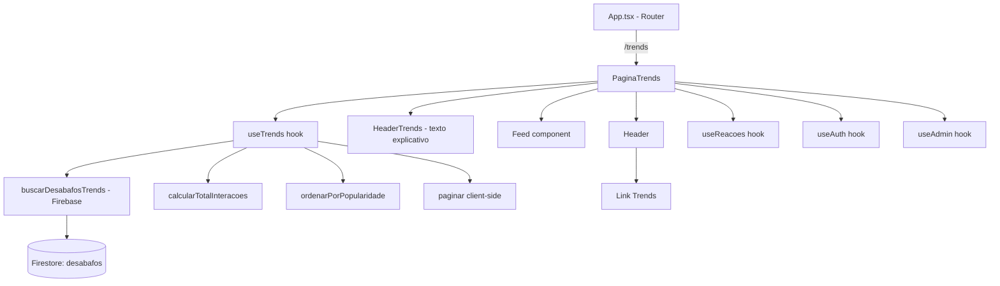

# Design Document: Trends Page (feature-004-trends-page)

## Overview

A página Trends exibe os desabafos mais populares dos últimos 30 dias, ordenados por total de interações (reações + comentários). Como o Firestore não suporta ordenação por campos computados, a estratégia adotada é buscar todos os desabafos do período usando `where('criadoEm', '>=', thirtyDaysAgo)` e realizar a ordenação e paginação inteiramente no cliente.

A feature reutiliza os componentes existentes (`Feed`, `DesabafoCard`, `Header`) e hooks (`useReacoes`, `useAuth`, `useAdmin`), adicionando:
- Um novo hook `useTrends` para busca, ordenação e paginação client-side
- Um novo componente de página `PaginaTrends`
- Um link "Trends" no componente `Header`
- A rota `/trends` registrada no `App.tsx`

### Decisões Técnicas

| Decisão | Justificativa |
|---------|---------------|
| Ordenação client-side | Firestore não permite `orderBy` em campos computados (soma de reações + comentários) |
| Fetch todos do período | Volume esperado de desabafos em 30 dias é gerenciável no cliente (~centenas, não milhares) |
| Paginação client-side | Após fetch + sort no cliente, fatiar o array em páginas de 10 é trivial e eficiente |
| Reusar Feed/DesabafoCard | Manter UX consistente com o feed principal e evitar duplicação de código |
| Hook dedicado `useTrends` | Separação de responsabilidades — lógica de trends isolada do hook `useDesabafos` existente |

## Architecture



### Fluxo de Dados

1. `PaginaTrends` monta → `useTrends` dispara a query
2. `buscarDesabafosTrends()` faz query no Firestore: `where('criadoEm', '>=', thirtyDaysAgo)`
3. Resultado retorna todos os desabafos do período (sem ordenação específica do Firestore)
4. `useTrends` calcula `totalInteracoes` para cada desabafo
5. `useTrends` ordena por `totalInteracoes` desc, com tiebreaker por `criadoEm` desc
6. `useTrends` fatia o array: exibe os primeiros 10 (página inicial)
7. Usuário clica "Carregar mais" → exibe os próximos 10 do array já ordenado
8. Reações usam `useReacoes` com optimistic update sem reordenar a lista

## Components and Interfaces

### Novos Componentes

#### `PaginaTrends` (src/pages/PaginaTrends.tsx)

Página principal da rota `/trends`. Orquestra todos os hooks e componentes.

```typescript
// PaginaTrends renderiza:
// 1. Header (com LoginButton)
// 2. HeaderTrends (h2 explicativo)
// 3. Feed (com desabafos ordenados por popularidade)
```

#### `HeaderTrends` (inline na PaginaTrends)

Seção de heading `<h2>` com texto explicativo sobre o conteúdo da página. Será um elemento simples dentro da PaginaTrends, não um componente separado — não há reutilização prevista.

### Componentes Reutilizados

| Componente | Uso na PaginaTrends |
|------------|---------------------|
| `Header` | Topbar com link Trends adicionado |
| `LoginButton` | Botão login/logout no Header |
| `Feed` | Renderizar lista de desabafos |
| `DesabafoCard` | Cada card individual |
| `ComentarioSection` | Comentários em cada card |

### Modificações em Componentes Existentes

#### `Header` (src/components/Header.tsx)

Adicionar link "Trends" na área `header__acoes`, após "Feed" e antes de "Moderação":

```typescript
// Ordem dos links:
// children (LoginButton) → Feed → Trends → Moderação (se admin)
```

O link usa a mesma classe CSS `header__link-nav` já existente.

### Novo Hook

#### `useTrends` (src/hooks/useTrends.ts)

```typescript
interface UseTrendsReturn {
  desabafos: Desabafo[];       // Página atual de desabafos (já ordenados)
  isLoading: boolean;          // Carregando dados iniciais
  error: string | null;        // Mensagem de erro
  hasMore: boolean;            // Existem mais para exibir
  loadMore: () => void;        // Avançar para próxima página
  total: number;               // Total de desabafos no período
}
```

**Responsabilidades:**
1. Buscar todos os desabafos dos últimos 30 dias via `buscarDesabafosTrends()`
2. Calcular `totalInteracoes` para cada um
3. Ordenar por `totalInteracoes` desc (tiebreaker: `criadoEm` desc)
4. Gerenciar paginação client-side (10 por página)
5. Tratar erros e timeout (10s) com `operacaoSegura`

### Nova Função Firebase

#### `buscarDesabafosTrends` (src/firebase/desabafos.ts)

```typescript
export async function buscarDesabafosTrends(): Promise<Desabafo[]>
```

Executa query no Firestore:
```typescript
query(
  collection(db, 'desabafos'),
  where('criadoEm', '>=', Timestamp.fromDate(thirtyDaysAgo)),
  orderBy('criadoEm', 'desc')
)
```

Retorna todos os desabafos do período convertidos para o tipo `Desabafo` (sem uid).

### Funções Utilitárias Puras (src/utils/trends.ts)

```typescript
/**
 * Calcula o total de interações de um desabafo.
 * Trata campos ausentes como 0.
 */
export function calcularTotalInteracoes(desabafo: Desabafo): number

/**
 * Ordena desabafos por total de interações (desc).
 * Tiebreaker: criadoEm mais recente primeiro.
 * Retorna novo array (não muta o original).
 */
export function ordenarPorPopularidade(desabafos: Desabafo[]): Desabafo[]

/**
 * Retorna uma fatia do array para a página solicitada.
 * @param pagina - Número da página (1-indexed)
 * @param tamanhoPagina - Itens por página (default: 10)
 */
export function paginar<T>(items: T[], pagina: number, tamanhoPagina?: number): T[]
```

## Data Models

### Dados Existentes (sem alterações)

O Firestore já contém todos os dados necessários. Não há novos campos ou coleções.

```typescript
// DesabafoDoc (já existe no Firestore)
interface DesabafoDoc {
  texto: string;
  sentimento: Sentimento;
  criadoEm: Timestamp;
  uid: string;
  reacoes: {
    apoio: number;   // default 0
    forca: number;   // default 0
    pouco: number;   // default 0
  };
  totalComentarios: number;  // default 0
  numero?: number;
}
```

### Índice Firestore Necessário

A query `where('criadoEm', '>=', ...) + orderBy('criadoEm', 'desc')` utiliza um único campo (`criadoEm`) para filtro e ordenação. Isso funciona com o índice single-field automático do Firestore — **nenhum índice composto adicional é necessário**.

### Modelo Computado (client-side apenas)

```typescript
// Usado internamente pelo useTrends para ordenação
interface DesabafoComScore extends Desabafo {
  totalInteracoes: number;  // apoio + forca + pouco + totalComentarios
}
```

Este tipo é interno ao hook e não precisa ser exportado.

## Correctness Properties

*A property is a characteristic or behavior that should hold true across all valid executions of a system—essentially, a formal statement about what the system should do. Properties serve as the bridge between human-readable specifications and machine-verifiable correctness guarantees.*

### Property 1: Total de interações é calculado corretamente

*For any* desabafo com quaisquer valores numéricos (incluindo 0) nos campos `reacoes.apoio`, `reacoes.forca`, `reacoes.pouco` e `totalComentarios`, `calcularTotalInteracoes` SHALL retornar a soma exata desses quatro campos, tratando campos ausentes como 0.

**Validates: Requirements 4.1**

### Property 2: Ordenação decrescente por total de interações

*For any* lista de desabafos, após aplicar `ordenarPorPopularidade`, cada desabafo na posição `i` SHALL ter `totalInteracoes >= totalInteracoes` do desabafo na posição `i+1`.

**Validates: Requirements 1.2, 4.2**

### Property 3: Tiebreaker por data mais recente

*For any* par de desabafos adjacentes no resultado de `ordenarPorPopularidade` que possuem o mesmo `totalInteracoes`, o desabafo na posição anterior SHALL ter `criadoEm >= criadoEm` do desabafo na posição seguinte.

**Validates: Requirements 4.3**

### Property 4: Filtro de 30 dias

*For any* conjunto de desabafos com datas variadas, após aplicar o filtro de período, todos os desabafos no resultado SHALL ter `criadoEm >= (now - 30 dias)`, e nenhum desabafo com `criadoEm < (now - 30 dias)` SHALL estar presente no resultado.

**Validates: Requirements 3.1, 3.2**

### Property 5: Paginação preserva ordem e integridade

*For any* lista ordenada de desabafos de tamanho N, a função `paginar(items, pagina, 10)` SHALL retornar os itens `[(pagina-1)*10, pagina*10)` do array original, preservando a ordem. Adicionalmente, a concatenação de todas as páginas válidas SHALL ser igual ao array original completo.

**Validates: Requirements 7.1, 7.2, 7.3, 7.4**

## Error Handling

| Cenário | Comportamento |
|---------|---------------|
| Query Firestore falha | `useTrends` define `error` com mensagem "Não foi possível carregar os desabafos em alta." e exibe botão "Tentar novamente" |
| Timeout > 10s | `operacaoSegura` rejeita a promise → mesmo tratamento de erro acima |
| Lista vazia (sem desabafos no período) | Exibe mensagem "Não há desabafos em alta no momento." com o HeaderTrends visível acima |
| Campos de reação ausentes/undefined | `calcularTotalInteracoes` trata como 0 (fallback com `?? 0` ou `\|\| 0`) |
| Reação falha (Firestore) | `useReacoes` faz rollback do optimistic update (comportamento existente) |

## Testing Strategy

### Unit Tests (Jest + Testing Library)

Testes de exemplos específicos e edge cases:

- **PaginaTrends**: Renderiza Header, HeaderTrends(h2), Feed. Exibe loading, empty state, error state.
- **Header com link Trends**: Link "Trends" presente, posição correta, href `/trends`.
- **Rota /trends**: Renderiza PaginaTrends corretamente.
- **Empty state**: Mensagem exibida quando lista vazia.
- **Error state**: Mensagem de erro + botão retry quando query falha.
- **Reação não reordena**: Lista permanece estável após reação.

### Property-Based Tests (fast-check)

Testes de propriedades universais com mínimo de 100 iterações cada:

| Property | Função sob teste | Gerador |
|----------|------------------|---------|
| Property 1 | `calcularTotalInteracoes` | Desabafos com reações aleatórias (0-9999) |
| Property 2 | `ordenarPorPopularidade` | Listas de 0-100 desabafos com scores variados |
| Property 3 | `ordenarPorPopularidade` | Listas com desabafos de scores duplicados e datas variadas |
| Property 4 | Lógica de filtro de data | Desabafos com `criadoEm` em range amplo (60 dias antes até agora) |
| Property 5 | `paginar` | Arrays de 0-200 itens com páginas variadas |

**Configuração:**
- Biblioteca: `fast-check` (já instalada no projeto)
- Cada teste tagueado com: `Feature: feature-004-trends-page, Property {N}: {título}`
- Mínimo 100 iterações por propriedade

### Integration Tests

- Navegação Feed → Trends → Desabafo via links
- Reações na PaginaTrends persistem no Firestore (com mock)
